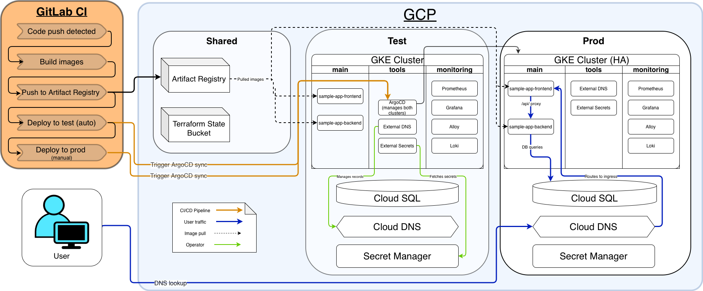

# Cloud Migration to GCP
Production-grade Kubernetes infrastructure with GitOps, monitoring, and CI/CD

## Project Overview
This project is a cloud migration of a full-stack web application to Google Cloud Platform. The application runs on GKE in two environments (test and production), each in its own GCP project.

Infrastructure is provisioned with Terraform and deployed through Helm charts managed by ArgoCD following GitOps principles. A GitLab CI pipeline automatically deploys to `test` with manual approval required for `production`.

### Tech Stack
| Technology | Role |
|---|---|
| **Google Cloud Platform** | Cloud provider (GKE, Cloud SQL, Cloud DNS, Secret Manager, Artifact Registry) |
| **Terraform** | Infrastructure as Code to provision GCP resources |
| **Kubernetes (GKE)** | Container orchestration for clusters with dedicated node pools |
| **ArgoCD** | For continuous delivery using the app-of-apps pattern (GitOps) |
| **GitLab CI** | CI/CD pipeline that tests, builds, deploys with manual `prod` approval |
| **Helm** | Kubernetes package management with charts for all applications |
| **Prometheus & Grafana** | Monitoring cluster metrics, dashboards, alerting |
| **Loki & Alloy** | Log aggregation with centralized application and cluster logs |
| **External Secrets** | Secrets management that syncs secrets from GCP Secret Manager via Workload Identity |
| **External DNS** | DNS automation that creates DNS records from Kubernetes Ingress resources |
| **WireGuard** | VPN for secure access to private clusters |
| **Docker** | Container builds for frontend and backend |

**Application stack:** React (frontend), Go (backend), PostgreSQL (database)

## Architecture
Three GCP projects isolate resources: `shared` (Artifact Registry, Terraform state), `test`, and `prod`.


### Infrastructure Design

#### Networking
Each environment has its own VPC with a private subnet. GKE nodes have no public IP addresses (all outbound traffic goes through a Cloud NAT gateway).\
The test and production VPCs are connected via VPC peering to allow ArgoCD on the test cluster to manage applications on the production cluster.

Public and private Cloud DNS zones are configured per environment.\
Public zones (`test-public`, `prod-public`) handle external-facing DNS records created automatically by External DNS. Private zones (`test-private`, `prod-private`) provide internal service discovery for resources like the database (`db.test-private.<domain>`).

#### Kubernetes (GKE)
Each cluster uses three dedicated node pools with taints and tolerations to isolate workloads:
- **`main`**: Application workloads (frontend, backend)
- **`tools`**: ArgoCD, External DNS, External Secrets
- **`monitoring`**: Prometheus, Grafana, Loki, Alloy

The test cluster is zonal (single zone, single control plane) for cost efficiency. The production cluster is regional (multi-zone nodes, HA control plane) for resilience.

#### Database
Cloud SQL for PostgreSQL with private IP only. Accessible within the VPC but not from the internet. Production uses `REGIONAL` availability for automatic failover to a standby replica. Backups are configured with point-in-time recovery.

Credentials are generated by Terraform, stored in GCP Secret Manager, and synced to Kubernetes via External Secrets using Workload Identity.

#### Secrets Management
External Secrets Operator connects to GCP Secret Manager through a `ClusterSecretStore` that authenticates via Workload Identity. `ExternalSecret` resources define which secrets to fetch, and the operator creates standard Kubernetes Secrets that pods get through environment variables.

#### Monitoring & Logging
Prometheus scrapes cluster and application metrics. Grafana provides dashboards for cluster health, node resources, and database metrics (via postgres-exporter). Alertmanager routes alerts to Discord.

Loki collects logs aggregated by Alloy, which runs as a DaemonSet across all nodes. Logs are queryable through Grafana's Explore view.

#### Access
GKE clusters use private endpoints. Admin access is through a WireGuard VPN server deployed by Terraform in the test environment. Grafana is exposed on a ClusterIP service accessible via `kubectl port-forward` or through the VPN.

### CI/CD Pipeline
A push to `main` triggers the GitLab CI pipeline which progresses through four stages:

1. **Test**: Runs backend integration tests using Docker Compose with a temporary PostgreSQL container.
2. **Build**: Builds Docker images for frontend and backend, tags them with the commit SHA, and pushes to Artifact Registry.
3. **Deploy to test** (automatic): Updates the image tag in ArgoCD and polls until both apps report healthy.
4. **Deploy to prod** (manual): Same as test, but requires manual approval in the GitLab UI. The pipeline blocks until an operator clicks to proceed.


The deploy stages use the ArgoCD CLI to set Helm parameters (`image.tag`) directly. ArgoCD then handles the rollout through its GitOps sync. This means the pipeline doesn't need cluster credentials. It only needs access to the ArgoCD API.

Authentication uses a GCP service account key (base64-encoded, stored as a masked GitLab CI variable) for Artifact Registry access, and an ArgoCD API token for deployments.

### Cost Optimization

#### Environment-appropriate resource sizing
The test environment uses zonal resources (single-zone GKE cluster, single-zone Cloud SQL) while production uses regional resources (multi-zone GKE, Cloud SQL with automatic failover). This avoids paying for HA redundancy where it isn't needed.

All node pools use `e2-medium` instances (the smallest practical size for Kubernetes workloads) and Cloud SQL uses the `db-f1-micro` tier. GKE's managed Prometheus is disabled since we run our own, avoiding duplicate costs.

#### Automated resource shutdown
Two shell scripts (`scripts/start.sh` and `scripts/stop.sh`) allow the entire infrastructure to be paused and resumed. `stop.sh` scales all node pools to zero, releases load balancers, and stops Cloud SQL instances leaving only storage costs (persistent disks, static IPs). `start.sh` restores everything in about 5-10 minutes.

#### Storage lifecycle policies
Artifact Registry has cleanup policies that retain the 20 most recent tagged images and delete untagged images older than 7 days, preventing unbounded storage growth from CI/CD.

Log buckets use tiered lifecycle rules. Test logs are deleted after 30 days. Production logs are moved to Nearline storage after 30 days and deleted after 90 days, balancing retention needs with storage costs.

#### Backup retention
Test keeps 7 daily backups with 1 day of transaction logs. Production keeps 30 daily backups with 7 days of transaction logs for point-in-time recovery. The shorter test retention reduces storage costs while production retains enough history for compliance and disaster recovery.

### Architecture Decisions

#### Why separate GCP projects?
Each environment lives in its own GCP project. A misconfigured Terraform apply in test can't destroy production resources. Each project has independent IAM, so developers can have broad access to test without affecting production. Billing is also separated, making per-environment cost tracking straightforward.

#### Why private clusters?
GKE nodes have no public IP addresses and the control plane is only accessible through authorized networks. This eliminates the attack surface. There's nothing for an attacker to reach from the internet, even if a Kubernetes RBAC policy or Service is misconfigured.

#### Why GitOps with ArgoCD?
Without GitOps, deployments rely on manual `helm install` or `kubectl apply` commands that aren't auditable and don't self-heal. ArgoCD watches the Git repository and continuously reconciles the cluster to match the desired state. If someone manually changes a resource in the cluster, ArgoCD reverts it.

#### Why External Secrets over Kubernetes Secrets in Git?
Hardcoding secrets in Helm values or Git is a security risk. External Secrets provides a single source of truth in GCP Secret Manager while delivering secrets to pods as standard Kubernetes Secrets.

#### Least privilege IAM
Each tool gets its own scoped service account with only the permissions it needs:
- `external-secrets`: `secretmanager.secretAccessor` (read secrets, can't create or delete)
- `external-dns`: `dns.admin` (manage DNS records, nothing else)
- `grafana`: `monitoring.viewer` (read-only cloud metrics)
- `gitlab-ci` (ArgoCD account): Can sync and get applications, can't modify ArgoCD settings or delete projects

The root Google account is only used for initial project setup. All ongoing management uses a dedicated Terraform service account whose key can be rotated or revoked independently.

## Setup & Usage Guide

### Prerequisites
- [GCP account](https://cloud.google.com) with three projects created
- Domain name with registrar access
- [GitLab account](https://gitlab.com) with a repository for this project
- CLI tools installed: `terraform`, `helm`, `kubectl`, `gcloud`, `argocd`, `docker`, `wg` (WireGuard)

### 1. Initial groundwork

**IAM**
1. Create three GCP projects (e.g., `shared`, `test`, `prod`)
2. Create a `terraform` service account in the shared project:
   - Grant it **Owner** on all three projects
   - Create and download a JSON key

**Terraform state**
- Create a GCS bucket in the shared project for remote state
- Enable object versioning

**Enable prerequisite APIs**\
Terraform enables most APIs automatically, but the following must be enabled manually in the GCP Console (or via `gcloud`) before the first `terraform apply`, since they're needed for Terraform itself to function:

```sh
# In all three projects
gcloud services enable cloudresourcemanager.googleapis.com --project <SHARED_PROJECT_ID>
gcloud services enable cloudresourcemanager.googleapis.com --project <TEST_PROJECT_ID>
gcloud services enable cloudresourcemanager.googleapis.com --project <PROD_PROJECT_ID>

# In the shared project (needed for cross-project operations)
gcloud services enable sqladmin.googleapis.com --project <SHARED_PROJECT_ID>
gcloud services enable servicenetworking.googleapis.com --project <SHARED_PROJECT_ID>
```

**Domain**
- Register a domain. DNS zones and records are managed by Terraform and External DNS. Only NS delegation is needed manually (done in [step 7](#7-dns))

**Optional but recommended:**
- Enable 2-Step Verification on your Google account
- Set up budget alerts in Billing at 25%, 50%, 75%, and 100% thresholds

### 2. Replace placeholder values
Search and replace the following values across the entire repository:

| Placeholder | Replace with |
|---|---|
| `<TEST_PROJECT_ID>` | Your test GCP project ID |
| `<PROD_PROJECT_ID>` | Your prod GCP project ID |
| `<SHARED_PROJECT_ID>` | Your shared GCP project ID |
| `<DOMAIN>` | Your domain name |
| `<GITLAB_REPO_URL>` | Your GitLab repository URL |
| `<GCP_REGION>` | Your preferred GCP region |
| `<PROD_CLUSTER_ENDPOINT>` | Prod cluster API endpoint (after step 4) |
| `<ADMIN_IP>/32` | Your public IP |
| `<TEST_NAT_GATEWAY_IP>/32` | Test NAT gateway IP (from Terraform output, after step 3) |

Also create `scripts/config.sh` from `scripts/config.example.sh` and fill in your values.

### 3. Deploy shared resources
Create `terraform/shared/terraform.tfvars` (see `terraform.tfvars.example`) and apply:
```sh
cd terraform/shared && terraform init && terraform apply
```

### 4. Deploy test environment
Create `terraform/test/terraform.tfvars` (see `terraform.tfvars.example`) and apply:
```sh
cd terraform/test && terraform init && terraform apply
```

Connect kubectl:
```sh
gcloud container clusters get-credentials voyager-test \
  --zone <GCP_REGION>-b --project <TEST_PROJECT_ID>
```

### 5. Deploy production environment
Create `terraform/prod/terraform.tfvars` (see `terraform.tfvars.example`) and apply:
```sh
cd terraform/prod && terraform init && terraform apply
```

Connect kubectl:
```sh
gcloud container clusters get-credentials voyager-prod \
  --region <GCP_REGION> --project <PROD_PROJECT_ID>
```

### 6. ArgoCD configuration
Switch to the test cluster context (ArgoCD runs here and manages both environments):
```sh
kubectl config use-context gke_<TEST_PROJECT_ID>_<GCP_REGION>-b_voyager-test
```

Get the admin password and server IP:
```sh
kubectl -n argocd get secret argocd-initial-admin-secret \
  -o jsonpath='{.data.password}' | base64 -d

kubectl -n argocd get svc argocd-server \
  -o jsonpath='{.status.loadBalancer.ingress[0].ip}'
```

Log in and add the GitLab repo:
```sh
argocd login <ARGOCD-IP> --plaintext --username admin --password <password>

argocd repo add <GITLAB_REPO_URL> \
  --username <gitlab-user> --password <gitlab-access-token>
```

Register the prod cluster and create the parent apps:
```sh
argocd cluster add gke_<PROD_PROJECT_ID>_<GCP_REGION>_voyager-prod

argocd app create test-apps \
  --repo <GITLAB_REPO_URL> \
  --path argocd/test/applications \
  --dest-server https://kubernetes.default.svc \
  --dest-namespace argocd \
  --values values.yaml \
  --values values-external-dns.yaml \
  --values values-external-secrets.yaml \
  --values values-kube-prometheus-stack.yaml \
  --values values-loki.yaml \
  --values values-alloy.yaml \
  --values values-postgres-exporter.yaml \
  --values values-backend.yaml \
  --values values-frontend.yaml

argocd app create prod-apps \
  --repo <GITLAB_REPO_URL> \
  --path argocd/prod/applications \
  --dest-server https://kubernetes.default.svc \
  --dest-namespace argocd \
  --values values.yaml \
  --values values-external-dns.yaml \
  --values values-external-secrets.yaml \
  --values values-kube-prometheus-stack.yaml \
  --values values-loki.yaml \
  --values values-alloy.yaml \
  --values values-postgres-exporter.yaml \
  --values values-backend.yaml \
  --values values-frontend.yaml
```

Generate a CI token:
```sh
argocd account generate-token --account gitlab-ci
```

### 7. DNS
Terraform created Cloud DNS zones. Delegate them at your domain registrar.

Find the nameservers:
```sh
gcloud dns managed-zones describe test-public \
  --project <TEST_PROJECT_ID> --format="value(nameServers)"

gcloud dns managed-zones describe prod-public \
  --project <PROD_PROJECT_ID> --format="value(nameServers)"
```

Create these records at your registrar:

| Record | Type | Value |
|---|---|---|
| `test-public.<DOMAIN>` | NS | *(nameservers from above)* |
| `prod-public.<DOMAIN>` | NS | *(nameservers from above)* |
| `www.<DOMAIN>` | CNAME | `frontend.prod-public.<DOMAIN>` |

### 8. GitLab CI
In GitLab **Settings -> CI/CD -> Variables**, add:

| Variable | Value | Options |
|---|---|---|
| `GCP_SA_KEY` | Service account JSON key, base64-encoded (`base64 < key.json`) | Masked, Protected |
| `ARGOCD_AUTH_TOKEN` | Token from previous step | Masked, Protected |

Push to `main` to trigger the pipeline.

### Usage

**Deploying changes** \
Push to `main`. The pipeline tests, builds, deploys to test automatically, and waits for manual approval before production.

**Accessing ArgoCD**\
`http://argocd.test-public.<DOMAIN>`

**Accessing Grafana**\
Port-forward from the test cluster:
```sh
kubectl port-forward -n monitoring svc/kube-prometheus-stack-grafana 3000:80
# Username: admin | Password: prom-operator
```

**Start/stop infrastructure**\
`./scripts/start.sh` and `./scripts/stop.sh` to pause and resume the entire infrastructure for cost savings.

## What I'd do differently in production
- **Separate ArgoCD instances**: Currently ArgoCD on the test cluster manages both environments. In production, each environment should have its own ArgoCD instance to avoid a single point of failure and prevent test cluster issues from affecting prod deployments.

- **Terraform modules**: The `terraform/test/` and `terraform/prod/` directories share most of their code. Extracting the common resources into a reusable module with environment-specific variable files would reduce duplication and make changes safer.

- **Stricter IAM**: The Terraform service account currently has Owner on all projects for simplicity. A production setup would use fine-grained roles scoped to exactly the resources Terraform manages.

- **Horizontal Pod Autoscaling**: The application deployments use a fixed replica count. HPA would automatically scale pods based on CPU or request load.

- **Secrets rotation**: External Secrets syncs from GCP Secret Manager, but there's no automated rotation of the credentials themselves. A production system would rotate database passwords and JWT keys on a schedule.